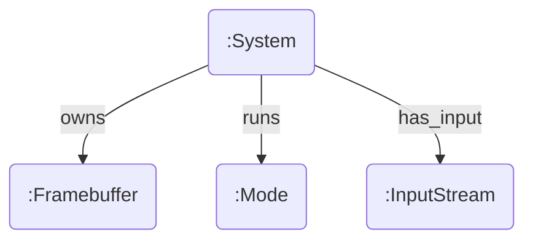

# System Thing Design

**Status**: Draft
**Phase**: 1.3 (Groundwork)

## Goal
Reify the concept of "System" and "Framebuffer" as first-class Things in the graph to eliminate "magic" globals and enable introspection.

## Current State
- `Framebuffer` is managed by `kernel/src/drivers/framebuffer.rs`, which registers a device node (`device.framebuffer`).
- Global system state (active mode, etc.) resides in `compositor` memory.

## Proposed Graph Structure

### 1. The System Thing
A singleton Thing representing the machine/OS instance.

**Properties:**
- `kind`: `:System`
- `active_mode`: UUID (link to current Mode)
- `hostname`: Text

### 2. The Framebuffer Thing
The driver already creates a Thing!
`kernel/src/drivers/framebuffer.rs` creates a node with kind `DEVICE` and label `FRAMEBUFFER_DEVICE`.

**Refinement:**
- Ensure it has properties: `width`, `height`, `pitch`, `bpp`, `addr` (if kernel-visible).
- Allow `Compositor` to claim ownership or `CAN_WRITE` capability to this Thing.

### 3. Input Streams
- `(:InputStream:Keyboard)`
- `(:InputStream:Mouse)`

## roadmap for Implementation (Phase 4)
1.  **Boot**: Init process (or Kernel) creates the `:System` thing.
2.  **Discovery**: Compositor looks up `:System` to find `:Framebuffer` and `:Mode`s.
3.  **State**: Compositor updates `:System.active_mode` instead of local variable.
